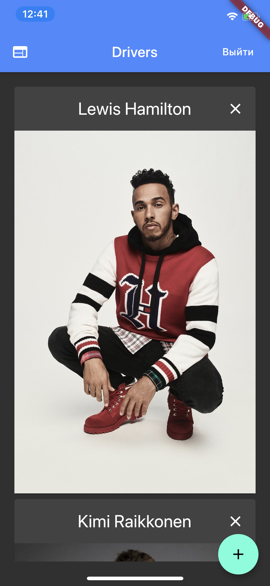
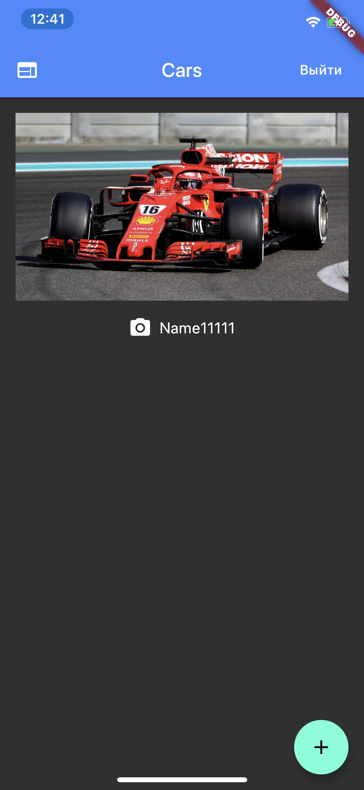
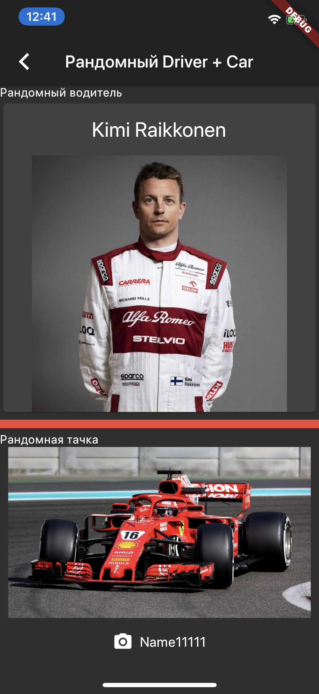
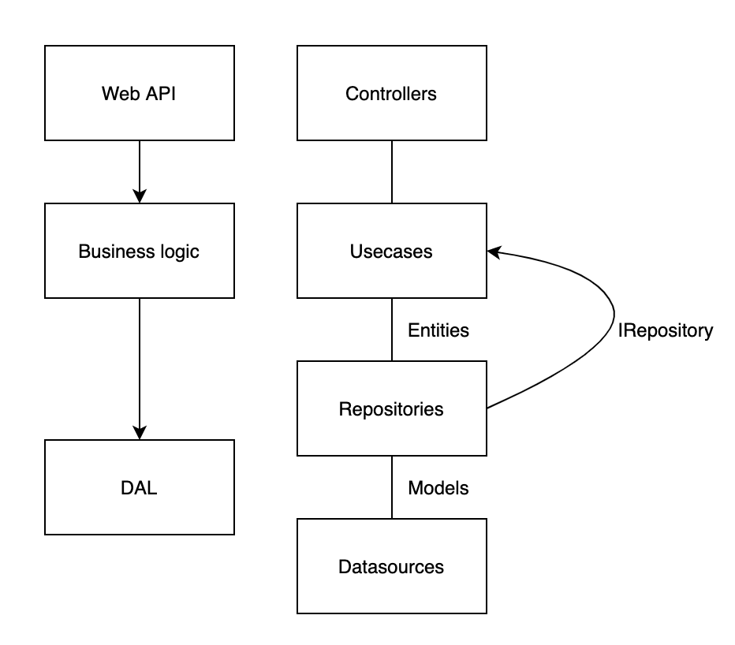

# car_drivers API
 Dart Aqueduct Server

 Getting started https://aqueduct.io/docs/tut/getting-started/
 
 БД PostgreSQL (в репо не лежит),
 Авторизация OAuth 2,
 SSL (self-signed)

 Есть простейшие тесты, валидации нет
 
 Контроллеры в lib,
 конфигурация в bin/main.dart
 
 1) Контроллер для водителей CRUD (без U)
 2) Контроллер для тачек CRUD (без U)
 3) Контроллер с одним GET для получения рандомной пары водитель + тачка
 
 * Для предмета java интернет-приложения есть useless controller, в котором кое-какая интернационализация для галочки
 
    
 
 
